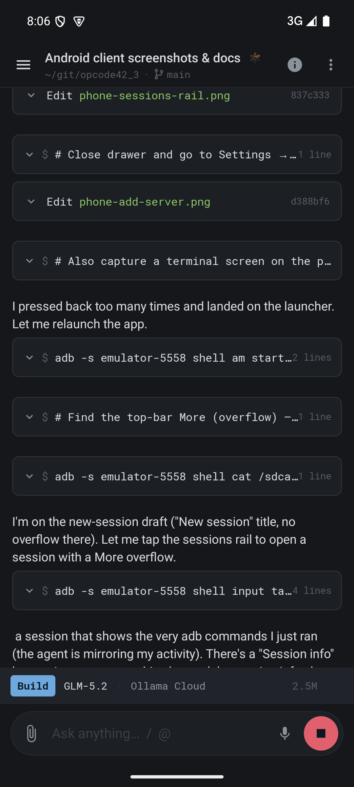
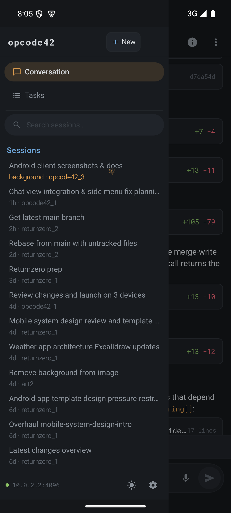
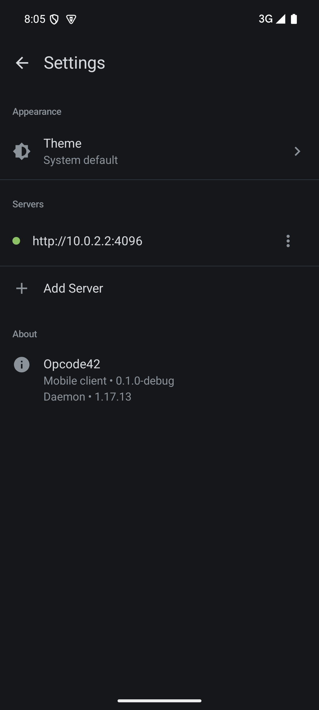
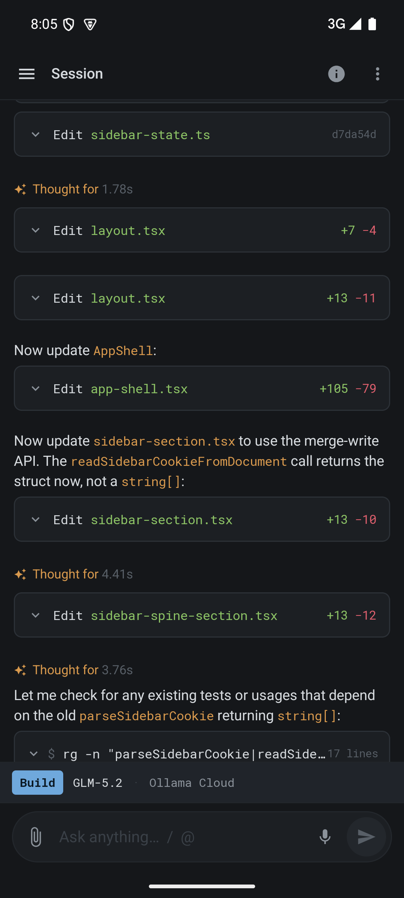
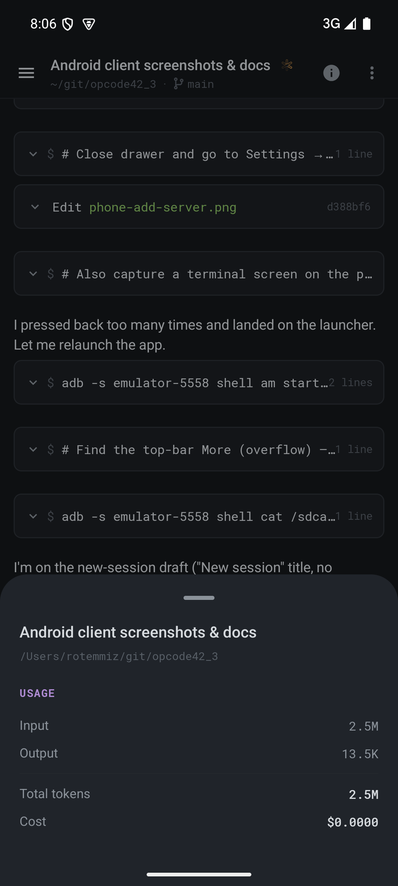
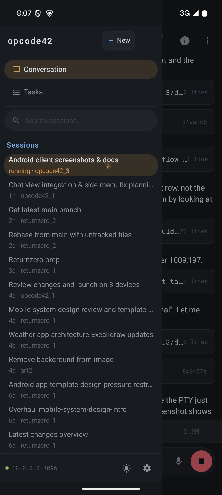
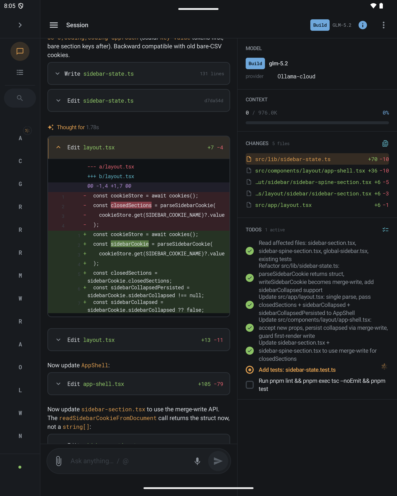
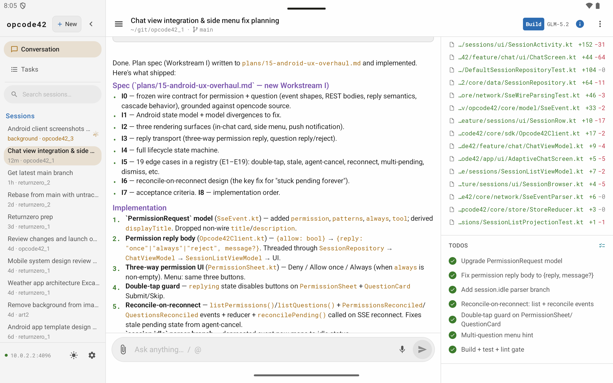

# Opcode42 for Android

The mobile client for Opcode42 — a ground-up, interop-first alternative to opencode.
A single Android app speaks the same opencode wire protocol (HTTP + SSE + WebSocket)
as the web/desktop and Go TUI clients, so it works against **either** daemon unchanged.

- **Min SDK 26 / Target SDK 35**, Kotlin 2.1, Compose, Hilt, Material 3 adaptive.
- Single APK, no flavors. Debug variant installs as `dev.opcode42.app.debug` alongside release.
- mDNS LAN discovery of opencode / Opcode42 daemons.
- Optional Firebase Cloud Messaging (build-time opt-in; builds clean without it).

## Screenshots

Phone (emulator-5558), foldable (emulator-5556), tablet (emulator-5554):

| Phone — chat | Phone — sessions rail | Phone — settings |
|---|---|---|
|  |  |  |

| Phone — add server (mDNS) | Phone — session info | Phone — terminal |
|---|---|---|
|  |  |  |

| Foldable — two-pane | Tablet — triptych (dark) | Tablet — triptych (light) |
|---|---|---|
|  |  |  |

## Build & install

See [`BUILD.md`](BUILD.md) for prerequisites, building the APK, installing on a device or
emulator, build variants, tests, and the opt-in Firebase Cloud Messaging setup.

## Connect to a daemon

The app boots into the **Connect** screen when no server is configured
(`Opcode42NavGraph.kt:74`), otherwise into the chat home.

Three ways to point the app at a daemon:

1. **mDNS auto-discovery** — any opencode or Opcode42 daemon advertising `_http._tcp` or
   `_opencode._tcp` with a service name prefixed `opencode-` / `opcode42-` shows up under
   **Nearby servers** on the Connect / Add Server screen. Tap a row to autofill the URL.
   `MdnsDiscovery.kt` acquires a `MulticastLock` and browses both service types in parallel;
   on emulators (where multicast doesn't cross the NAT) it probes `10.0.2.2` on common ports.

2. **Manual URL** — type `http://<host>:<port>` (default `http://192.168.1.10:4096`).
   Credentials are optional and stored in `EncryptedSharedPreferences`.

3. **Emulator host** — the special `10.0.2.2` address reaches the host machine's loopback
   from inside an AVD. A daemon running on your laptop on port 4096 is reachable as
   `http://10.0.2.2:4096`.

### Running a daemon the app can reach

The app needs cleartext HTTP to `http://` daemon URLs on the LAN (declared via
`android:usesCleartextTraffic="true"` in the app manifest). To run a daemon on a non-loopback
interface, set a password first:

```sh
OPENCODE_SERVER_PASSWORD=secret opcoded --host 0.0.0.0 --port 4096
# or, with mDNS advertising:
OPENCODE_SERVER_PASSWORD=secret opencode serve --mdns --hostname 0.0.0.0
```

See [`plans/13-remote-ops.md`](../plans/13-remote-ops.md) for Tailscale / SSH-tunnel / reverse-proxy setups.

## Features

- **Adaptive triptych layout** — single pane on phone, two-pane on foldable, full
  sessions-rail + chat + info-panel on tablet. The left rail morphs open⇄collapsed; the
  right info panel slides in/out animated. (`AdaptiveChatScreen.kt`, `ChatScreen.kt`)
- **Streaming chat** — SSE `message.part.delta` events stream live; markdown, fenced code
  with syntax highlighting, GFM tables, reasoning ("Thought for N.NNs") blocks, file
  attachments, and inline unified diffs with word-level highlighting and line numbers.
  (`feature/chat`, `core/design/SyntaxHighlight.kt`, `PartRenderer.kt`)
- **Tool-call rendering** — consecutive tool calls collapse into compact TUI-glyph rows
  (`→ Read src/http.ts`, `* Grep "fetch(" · 2`); `bash` / `write` get collapsible output
  blocks; `task` sub-agents get a spark-marked status card.
- **Sessions** — searchable, filtered (All / Working / Needs input), grouped by date,
  long-press or swipe to rename / fork / archive / delete. Inline Approve/Deny and
  Reply/Skip affordances when a background session needs you.
- **Terminal** — embedded PTY over WebSocket (`ws://host/pty/{id}/connect`). Binary control
  frames (`0x00 + {"cursor":N}`) track the server cursor for reconnect resume; viewport
  cols/rows are reported via `PUT /pty/{id}`. Pure-Kotlin terminal emulator handles CSI/SGR.
  (`feature/terminal`, `core/sdk/PtyClient.kt`, `TerminalEmulator.kt`)
- **Slash-command palette** — `/` opens a palette of built-ins (`/new`, `/sessions`,
  `/models`, `/agents`, `/terminal`, `/info`, `/rename`, `/fork`, `/summarize`, `/share`,
  `/archive`, `/delete`) merged with the daemon's own `GET /command` commands. `@` triggers
  file-mention autocomplete against `GET /find/file`.
- **Voice dictation** — continuous `SpeechRecognizer` with an amplitude-halo mic button.
  (`feature/chat/VoiceInput.kt`)
- **Push notifications** — opt-in FCM. Permission requests, agent questions, and
  session-idle events surface as system notifications with a deep-link back to the session.
  (`feature/notifications`)
- **Theme** — System / Light / Dark, persisted in DataStore. (`feature/settings/AppPreferences.kt`,
  `core/design/Opcode42Theme.kt`)

## Module structure

13 Gradle modules (`settings.gradle.kts`):

```
:app                        application shell, nav graph, adaptive host, deep-link entry
:core:model   (KMP)         wire/domain models, kotlinx.serialization
:core:network (KMP)         OkHttp + SSE envelope parser, AuthInterceptor, SseManager
:core:store   (KMP)         redux-style AppStore / StoreReducer over AppState
:core:sdk                   hand-written REST client, PTY WebSocket client, terminal emulator
:core:data                  repository layer between ViewModels and the SDK/store
:core:design                theme tokens, typography, brand mark, syntax highlight, rail morph
:feature:connections        server list, EncryptedSharedPreferences, mDNS discovery
:feature:sessions           sessions list, session row morph, pending-action affordances
:feature:chat               chat surface, composer, sheets, slash commands, voice input
:feature:settings           servers, theme picker, about
:feature:terminal           PTY-over-WebSocket terminal screen
:feature:notifications      FCM push (opt-in), NotificationPublisher, deep-link contract
```

`:core:model`, `:core:network`, and `:core:store` are Kotlin Multiplatform modules
(`commonMain` + `androidMain`) so the wire protocol layer can be shared with a future iOS port.

## Permissions

| Permission | Why |
|---|---|
| `INTERNET` | HTTP/WS to the daemon |
| `RECORD_AUDIO` | voice dictation via `SpeechRecognizer` |
| `CHANGE_WIFI_MULTICAST_STATE` | mDNS multicast discovery (`MulticastLock`) |
| `POST_NOTIFICATIONS` (Android 13+) | agent-activity push notifications; requested at runtime |
| `<queries>` for `android.speech.RecognitionService` | package visibility for `SpeechRecognizer` on targetSdk 30+ |

Notable by absence: no `FOREGROUND_SERVICE`, no `WAKE_LOCK`, no `ACCESS_NETWORK_STATE`.
The SSE stream is foreground-scoped (`ProcessLifecycleOwner`); push notifications are the
background-delivery path. `allowBackup="false"` is deliberate — `EncryptedSharedPreferences`
master key lives in the Android Keystore and is not included in Auto Backup, so a restored
prefs file would be undecryptable and crash on first launch.

## Further reading

- [`BUILD.md`](BUILD.md) — build, install, variants, tests, FCM opt-in
- [`plans/07-client-mobile.md`](../plans/07-client-mobile.md) — original engineering plan
- [`plans/15-android-ux-overhaul.md`](../plans/15-android-ux-overhaul.md) — UX overhaul (workstreams A–H)
- [`design/android/README.md`](../design/android/README.md) — design handoff
- [`CONTRIBUTING.md`](../CONTRIBUTING.md) — git workflow, CI gate